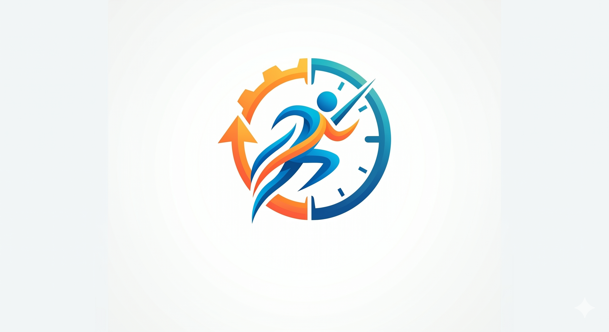
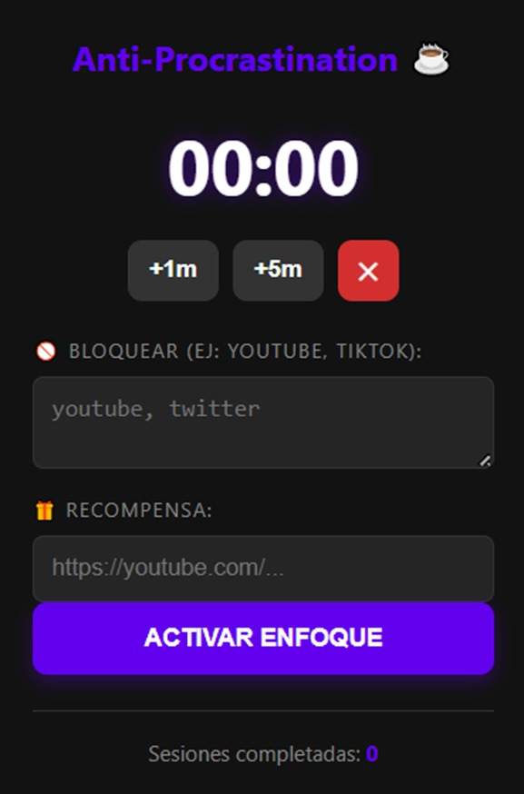
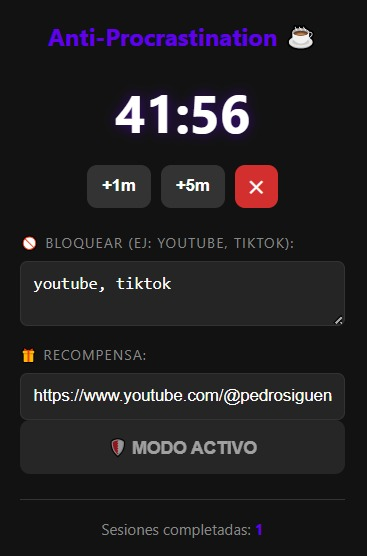
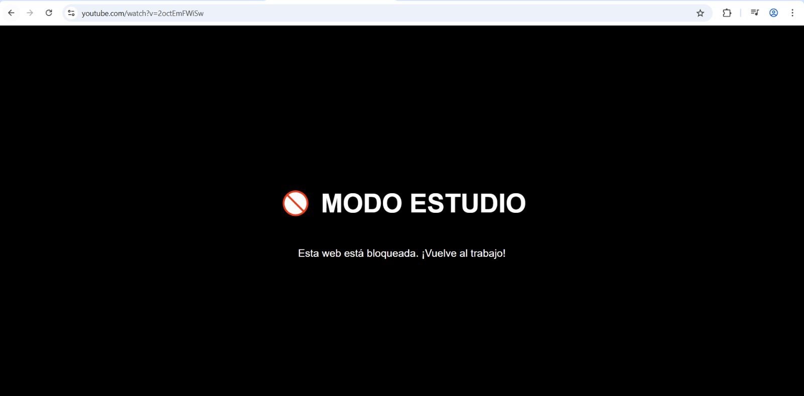

# Anti-Procrastination Extension

This is a productivity tool for Google Chrome designed to combat distractions through a website blocking system and automated rewards.

### [📥 Downloads (Latest Release)](https://github.com/EphEsWrath20/Anti-procrastination/releases/latest)

---

## 📖 Overview
The goal of this tool is to help users establish **Deep Work** periods. During these sessions, the extension restricts access to distracting websites and, upon completion, rewards the user by automatically opening a tab with their chosen content.

## ✨ Key Features
* **Flexible Timer:** Quickly set study sessions by adding 1-minute or 5-minute intervals.
* **Content Blocking:** Filters access to forbidden URLs based on user-defined keywords.
* **DOM Substitution:** If a blocked site is accessed, the content script stops the page load and replaces the body with a "Study Mode" warning.
* **Reward System:** Once the session ends, the extension automatically opens a predefined URL (e.g., a music video or news portal).

## 📸 Screenshots

<table border="0">
  <tr>
    <td align="center"></td>
    <td align="center"></td>
  </tr>
  <tr>
    <td align="center"><b>Main Timer</b></td>
    <td align="center"><b>Timer Running</b></td>
  </tr>
</table>

  <table border="0">
  <tr>
    <td align="center"></td>
  </tr>
  <tr>
    <td align="center"><b>Blocked Site (Study Mode)</b></td>
  </tr>
</table>

---

---

## 🚀 How to install
1. Download the `.zip` from the [Downloads](https://github.com/EphEsWrath20/Anti-procrastination/releases/latest) section.
2. Unzip the file.
3. Open Chrome and go to `chrome://extensions/`.
4. Enable **Developer mode**.
5. Click **Load unpacked** and select the project folder.
